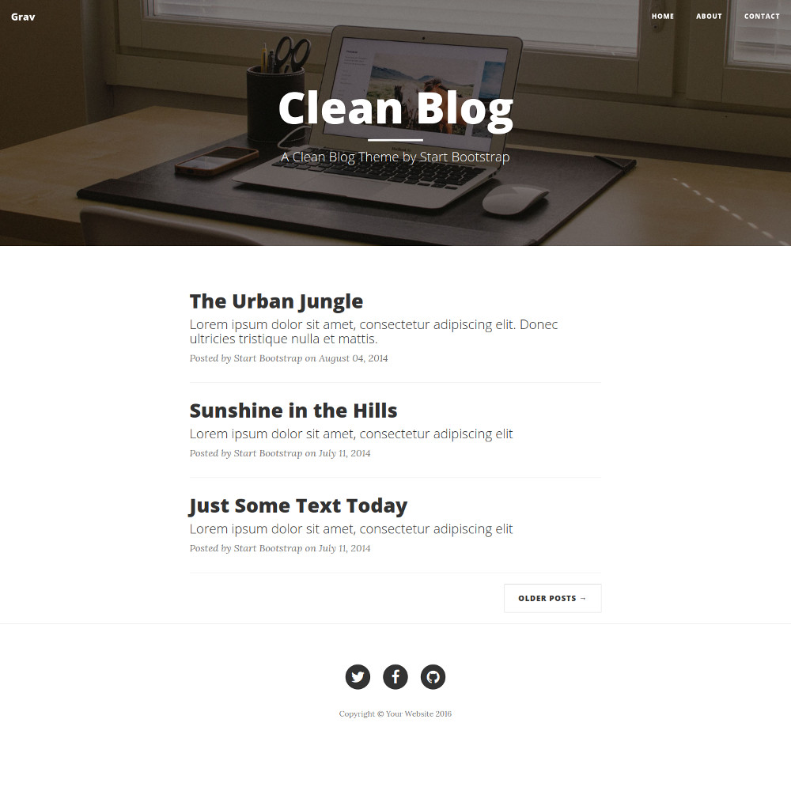

# Clean Blog theme for Grav CMS

Clean Blog theme is a port of [Clean Blog](https://startbootstrap.com/template-overviews/clean-blog/) by [Start Bootstrap](https://startbootstrap.com/).

# Features

* Fully responsive
* Modern design with a subtle splash of color (which is easy to customize, especially with LESS!)
* Distraction free blog text optimized for legibility with a menu bar interface that conveniently appears when you scroll up!
* Footer with social links and copyright information
* LESS files included for deeper customization options

# Installation

## GPM Installation (Preferred)

The simplest way to install this theme is via the [Grav Package Manager (GPM)](http://learn.getgrav.org/advanced/grav-gpm) through your system's Terminal (also called the command line).  From the root of your Grav install type:

    bin/gpm install clean-blog

This will install the Gateway theme into your `/user/themes` directory within Grav. Its files can be found under `/your/site/grav/user/themes/clean-blog`.

## Manual Installation

To install this theme, just download the zip version of this repository and unzip it under `/your/site/grav/user/themes`. Then, rename the folder to `clean-blog`.

You should now have all the theme files under

    /your/site/grav/user/themes/clean-blog

## Required Plugins:

* [Error](https://github.com/getgrav/grav-theme-error)
* [Problems](https://github.com/getgrav/grav-plugin-problems)
* [Email](https://github.com/getgrav/grav-plugin-email)
* [Form](https://github.com/getgrav/grav-plugin-form)

# Setup

If you want to set Clean Blog as the default theme, you can do so by following these steps:

* Navigate to `/your/site/grav/user/config`.
* Open the **system.yaml** file.
* Change the `theme:` setting to `theme: clean-blog`.
* Save your changes.
* Clear the Grav cache. The simplest way to do this is by going to the root Grav directory in Terminal and typing `bin/grav clear-cache`.

Once this is done, you should be able to see the new theme on the frontend. Keep in mind any customizations made to the previous theme will not be reflected as all of the theme and templating information is now being pulled from the **clean-blog** folder.

# Manage page with Admin plugin

If you have [Admin plugin](https://github.com/getgrav/grav-plugin-admin) installed, you can set subheading and header's background image when you edit a page, they are at the bottom of **Content** tab.

# Updating

## GPM Update (Preferred)

The simplest way to update this theme is via the [Grav Package Manager (GPM)](http://learn.getgrav.org/advanced/grav-gpm). You can do this with this by navigating to the root directory of your Grav install using your system's Terminal (also called command line) and typing the following:

    bin/gpm update clean-blog

This command will check your Grav install to see if your Gateway theme is due for an update. If a newer release is found, you will be asked whether or not you wish to update. To continue, type `y` and hit enter. The theme will automatically update and clear Grav's cache.

## Manual Update

Manually updating Clean Blog is pretty simple. Here is what you will need to do to get this done:

* Delete the `your/site/user/themes/clean-blog` directory.
* Download the new version of the Clean Blog theme from this repository.
* Unzip the zip file in `your/site/user/themes` and rename the resulting folder to `clean-blog`.
* Clear the Grav cache. The simplest way to do this is by going to the root Grav directory in terminal and typing `bin/grav clear-cache`.

> Note: Any changes you have made to any of the files listed under this directory will also be removed and replaced by the new set. Any files located elsewhere (for example a YAML settings file placed in `user/config/themes`) will remain intact.
